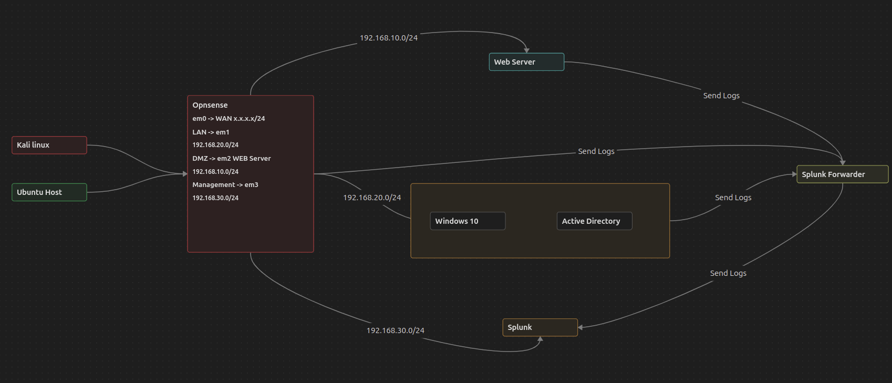

# 🛡️ SOC Home Lab — NexaTech Solutions

## Overview

NexaTech Solutions is a fully functional, self-built Security Operations Center
(SOC) home lab that simulates a realistic enterprise network. It was designed
and built end-to-end — network segmentation, Active Directory, SIEM, and
attacker infrastructure — to practice the full SOC analyst workflow: log
collection, detection engineering, attack simulation, and incident
investigation.

This repository documents the environment, the detection rules built in
Splunk, and a growing series of attack/defense exercises (simple attacks
first, then progressively more advanced techniques and countermeasures).

---

## 🖥️ Lab Components

| Component | Role |
|---|---|
| OPNsense Firewall | Network segmentation, traffic filtering, syslog forwarding |
| Windows Server 2022 | Active Directory, DNS, Group Policy |
| Windows 10 Pro | Endpoint simulation with Sysmon |
| Ubuntu Web Server | DMZ web server (Apache), MySQL database, query logging |
| Splunk SIEM | Log aggregation, detection rules, dashboards, alerting |
| Splunk Universal Forwarder | Log forwarding from endpoints to Splunk |
| Kali Linux | Attacker machine — external attack simulation |

---

## 🌐 Network Architecture

Kali Linux is connected via a **Bridged Adapter**, placing it on the same
network as the host machine — simulating an **external threat actor**
attacking the environment from outside the network perimeter, exactly as a
real attacker would target a public-facing web server over the internet.

---

## 🔀 Network Segmentation

| Network | Subnet | Purpose |
|---|---|---|
| LAN | 192.168.20.0/24 | Internal endpoints (AD, Windows 10) |
| DMZ | 192.168.10.0/24 | Public-facing web server |
| Management | 192.168.30.0/24 | Splunk SIEM |
| WAN | DHCP / Bridged | Internet access + external attacker (Kali) |

Segmentation follows a least-privilege model: the DMZ can only send logs to
Splunk (port 9997) and cannot initiate connections into the LAN. Each zone's
firewall rules are documented in [OPNsense.md](Environment-Setup/OPNsense.md).

---

## 📁 Repository Structure

| Folder | Contents |
|---|---|
| `Architecture/` | Network diagrams |
| `Environment-Setup/` | Setup & configuration guide for each component |
| `Detection-Rules/` | Splunk SPL queries, alerts, and dashboards |
| `Attacks/` | Attack simulations, paired with the detection that catches them |
| `Investigations/` | Structured incident investigation write-ups |

---

## 🎯 Objectives

- Build a segmented, realistic enterprise network from scratch
- Simulate real-world attacks against a DMZ web server
- Collect and centralize logs in Splunk
- Engineer detection rules and validate them against live attacks
- Practice the analyst workflow: detect → investigate → document

---

## 🚧 Project Status

This is an actively evolving lab. The current phase focuses on baseline
attack/defense pairs (e.g., SSH brute force ↔ detection alert). Each new
addition follows the same pattern: **simulate an attack → confirm detection
→ document the investigation → then increase attack/defense complexity.**

See [Attacks/README.md](Attacks/README.md) for the current exercise log.
